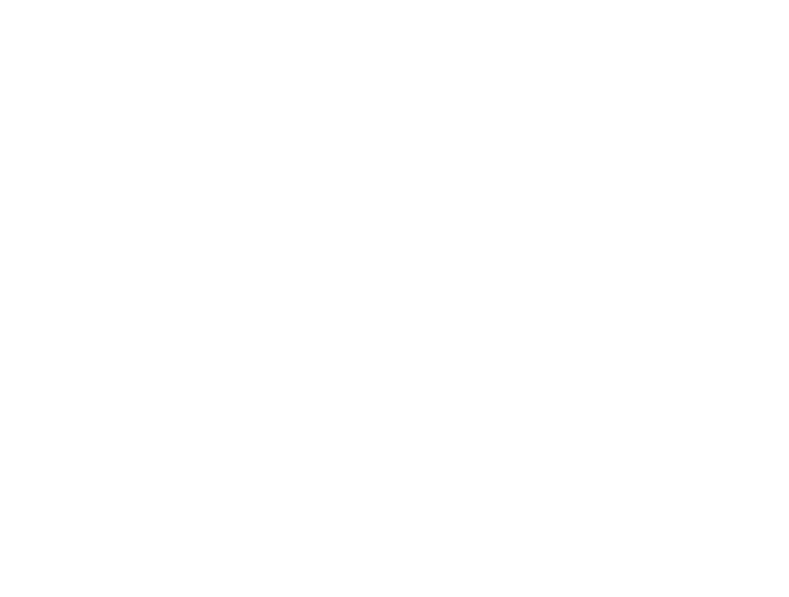

# 🏦 Loan Rating Quantization using K-Means

## 📌 Project Overview

This project develops a credit rating system by transforming continuous FICO credit scores into discrete rating categories using the K-Means clustering algorithm.

The generated ratings are validated using borrowers' observed probability of default, demonstrating a clear relationship between credit quality and credit risk.

---

# 📊 FICO Score Distribution

<p align="center">

</p>

---

# 📉 Probability of Default by Rating

<p align="center">

</p>

---

# 📋 Rating Map

| Rating | FICO Range | Probability of Default |
|---------|------------|-----------------------:|
| 1 | 707 - 850 | 4.49% |
| 2 | 655 - 706 | 9.19% |
| 3 | 609 - 654 | 15.96% |
| 4 | 556 - 608 | 28.25% |
| 5 | 408 - 555 | 51.13% |

---

# ⚙️ Technologies

- Python
- Pandas
- NumPy
- Matplotlib
- Scikit-Learn
- Jupyter Notebook

---

# 🚀 Methodology

The project follows these steps:

1. Load and explore the loan portfolio dataset.
2. Analyze the distribution of FICO scores.
3. Apply K-Means clustering to quantize FICO scores.
4. Generate discrete credit ratings.
5. Compute the probability of default for each rating.
6. Validate the resulting rating system.

---

# 📈 Key Findings

- Borrowers with higher FICO scores consistently exhibit lower probabilities of default.
- K-Means clustering successfully generated meaningful rating buckets.
- The generated rating map can be incorporated into credit risk models and scorecards.

---

# 📂 Repository Structure

```text
Loan-Rating-Quantization/

│
├── data/
├── images/
├── notebook/
├── README.md
├── requirements.txt
└── .gitignore
```

---

# 👨‍💻 Author

**Rodrigo López Dulcey**

